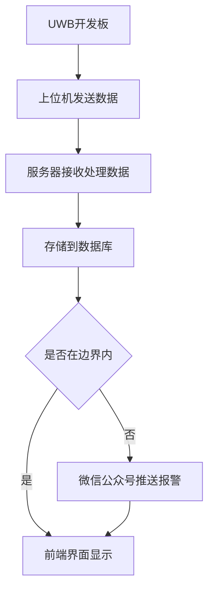

# 0x00 开发环境准备

> 以下为各个部分代码对应的仓库地址，需要克隆到本地
>
> [服务端代码](https://github.com/Seelly/uwb-goserver)
>
> [前端代码](https://github.com/Seelly/uwb-front)
>
> [上位机](https://github.com/Seelly/uwb-twr-bp30)
>
> 注意:此处后端代码已经将发行的前端文件包含在其中，如修改后请重新发行并更新文件

## IDE

> 推荐使用:

## 后端

> Golang+PostgreSql+InfluxDB，使用Gin框架+websocket

> 需要安装：
>
> Postgresql:PG支持多种数据类型（包括地理定位、JSON等）、复制、容错、并发控制和扩展性。
>
> InfluxDB:开源时序型数据库，专注于海量时序数据的高性能读、高性能写、高效存储与实时分析等，广泛应用于DevOps监控、IoT监控、实时分析等场景。

### 项目结构

```shell
├─common
│  └─global		#存放全局变量
├─controller	#controller层
├─initialize	#项目数据库，全局变量初始化
├─models		#model层，定义位置相关的结构体，对应数据表
├─router		#路由层，包括路由初始化
├─services		#存放业务逻辑
└─utils			#工具包，存放封装的工具函数
```

## 前端

> yarn+Vue2+elementui，vue-cli脚手架生成项目
>
> 只需关注src文件夹即可

> 需要安装：

### 项目结构

```shell
s://51uwb.cn...
└─src
    ├─assets		#图片等静态文件
    ├─components	#组件
    └─views			#页面s://51uwb.cn
```

## 上位机

> CPP QT编写
>
> 主要修改源文件 network/RTLSClient.cpp
>
> 更改部分数据结构体的定义，446行新增函数用于上传数据

> 需要安装：
>
> 需下载指定版本QT，否则可能编译出错，请自行查看http://51uwb.cn

# 0x01快速开始

## 运行后端

+ 环境搭建

  使用goland打开go_server文件夹路径，在终端执行以下命令：

  ```shell
  go mod tidy
  ```
  
+ 修改配置

  修改文件根目录中的config.yaml，在其中配置你的数据库信息

+ 执行以下命令运行服务

  ```shell
  go run main.go
  或
  go generate
  ```

+ 如需打包

  ```shell
  go build main.go #编译成windows可执行文件，如需在linux执行，自行查阅交叉编译
  ```

## 运行前端：

+ 环境搭建

  进入到front_client文件目录下，执行以下命令

  ```shell
  yarn
  ```

+ 执行以下命令运行服务

  ```shell
  yarn serve
  ```

+ 如需打包

  ```shell
  yarn build
  ```

运行成功后代开浏览器并访问http://localhost:8080，即可查看页面

## 上位机

+ 使用qt打开工程文件
+ 左下角选择 `release` 并编译运行，编译完成自动运行
+ 将 `基站0` 通过串口与电脑连接
+ 在编译完的上位机软件右上角选择串口并 `connect` 

此时上位机自动将解算出的坐标和距离信息上传至服务器，服务器通过websocket转发到前端页面中实时显示。

==*数据发送间隔约为50ms*==

# 0x02结果展示

* 界面展示

* 数据库结果

  

* 运行结果

  
  
  


# 0x03文档





## 3.1 服务器端

本文服务器基于Golang的gin框架搭建，前端基于vue2实现，服务器接收定位套件通过上位机上传的数据，并结合websocket推送到前端页面显示。数据存储采用postgresql和influxdb两个数据库实现。系统设计流程图如下所示：

### 3.1.1 Go 和 Gin

​	在本文中，我们使用 Go 语言和 Gin 框架来构建服务器应用程序。Go 是一种现代化、高性能的编程语言，对于高并发有着语言级的支持。Gin 则是一个基于 Go 语言的轻量级 Web 框架，提供了简单易用的 API 接口和高性能的处理能力。我们选择 Go 和 Gin 作为服务器端的开发语言和框架，以便快速构建可靠和高效的 Web 应用程序。由于开发套件的坐标上传在ms级，对并发性有一定要求，我们选择GO语言可以满足需求。

### 3.1.2 前后端交互

​	服务器端采用RESTful风格提供API接口，与上位机和前端页面进行数据交互和通信。此外为了实现实时数据推送和与前端页面的交互，我们采用了 Websocket 技术。Websocket 是一种在客户端和服务器之间实现双向通信的协议，可以在长时间的连接中实时传输数据。通过使用 Websocket，服务器可以将定位套件上传的数据推送到前端页面，并实现实时更新和交互功能。这种双向通信的特性使得服务器和前端页面能够实现实时数据交互和动态更新的功能。

部分路由信息如下：

| 路由       | 请求方法 | 描述                                           |
| ---------- | -------- | ---------------------------------------------- |
| api/ws     | GET      | 前端发起get请求，服务器将其升级为websocket连接 |
| api/ws     | POST     | 上位机向服务器推送数据                         |
| api/init   | POST     | 前端界面绘制场景图时提交保存                   |
| api/qrcode | GET      | 获取服务器生成带参数微信公众号二维码           |


### 3.1.3 InfluxDB 和 PostgreSQL

在服务器应用程序中，我们采用了 InfluxDB 和 PostgreSQL 两个数据库来存储数据。InfluxDB 是一个开源的时间序列数据库，专为处理大量时间序列数据而设计。我们使用 InfluxDB 来存储实时定位数据，并能够灵活地查询和分析这些数据。而 PostgreSQL 是一个强大的关系型数据库，具有丰富的功能和扩展性。我们使用 PostgreSQL 来存储其他与应用程序相关的数据，如用户信息、配置参数等。通过使用这两个数据库，我们能够有效地管理和存储应用程序所需的各种数据。

influxdb截图:


pgsql截图：


### 3.1.4微信公众号推

我们在系统中使用微信公众号推送机制实现了报警功能。当标签的数值越过设定的范围，并且在设定的报警频率内未进行推送时，系统将利用微信公众号推送报警通知给用户。

以下是实现该功能的步骤：

1. 标签数值监测：系统会定期监测标签的数值，并与设定的范围进行比较。如果数值超出设定范围，将触发报警。
2. 报警频率控制：系统会设定一个报警频率，即两次连续报警之间的最小时间间隔。如果在该时间间隔内已经进行了报警推送，系统将不会重复推送报警。
3. 微信公众号接入：我们通过微信公众平台接入系统的微信公众号。在微信公众平台上，我们配置了与系统对接的接口URL和凭证信息。
4. 报警推送逻辑：当标签的数值超出设定范围并满足报警频率的条件时，系统会调用微信公众号的推送接口，向用户的微信账号发送报警通知。

通过以上步骤，我们能够实现基于微信公众号的报警推送功能。用户会及时收到报警通知，并能够采取相应的措施来处理异常情况。

这种方式利用了微信公众号的广泛覆盖和即时性特点，为用户提供了方便快捷的报警通知方式，以确保及时处理可能发生的问题。


## 3.2 前端页面设计和实现

前端页面是用户与服务器应用程序交互的重要界面。在本文中，我们基于 Vue2 和 Element UI 来实现前端页面的设计和开发。Vue2 是一种流行的前端框架，具有简洁易用、高效灵活的特点，能够快速构建交互式的单页面应用程序。Element UI 是一套基于 Vue2 的组件库，提供了丰富的 UI 组件和样式，使得前端页面的开发变得简单和美观。

通过结合 Vue2 和 Element UI，我们能够轻松地创建响应式的前端页面，并实现数据的动态展示和用户交互功能。Vue2 提供了数据绑定、组件化和虚拟 DOM 等特性，使得页面的开发和维护更加便捷。Element UI 则提供了丰富的预定义组件，如表格、表单、按钮等，使得页面的构建更加高效和美观。

在前端页面设计和实现中，我们将重点考虑用户体验和界面的友好性。通过合理布局和设计，使得用户能够直观地查看和操作数据，并与服务器应用程序进行交互，并实时将行动轨迹绘制在界面上。

查看页

编辑页


## 3.3 QT上位机

为了上传定位套件的数据到服务器，我们选择对原有的 Qt 框架开发上位机应用程序进行修改。Qt 是一个跨平台的应用程序开发框架，具有强大的图形用户界面和网络通信功能。利用其串口通信能力从开发套件获得原始信息并进行计算。在原有的基础上引入qt的网络库，并编写相关方法将每次计算出的坐标与到三个基站距离等信息传输到服务器上。


